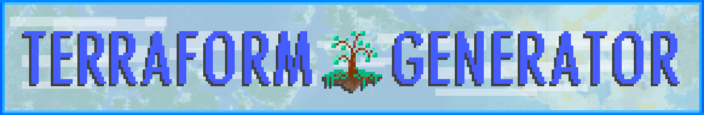
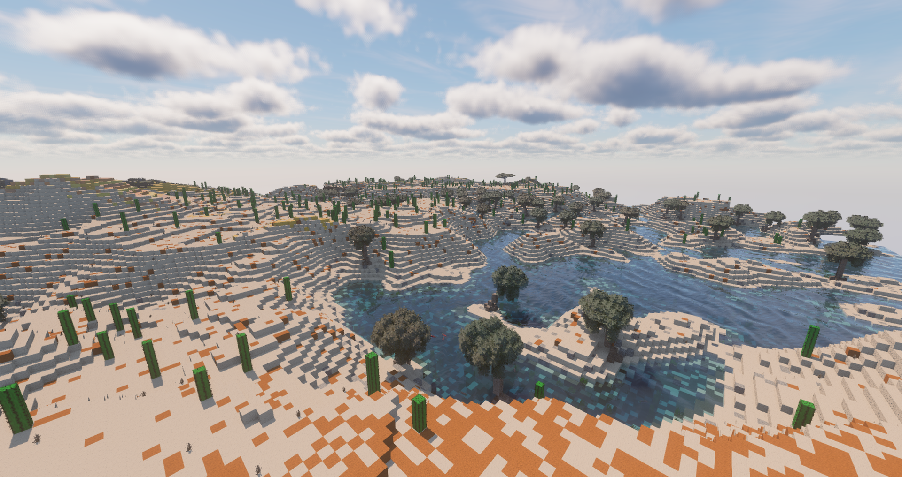
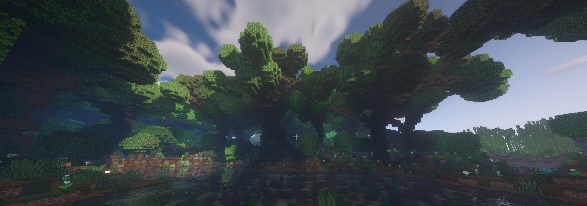
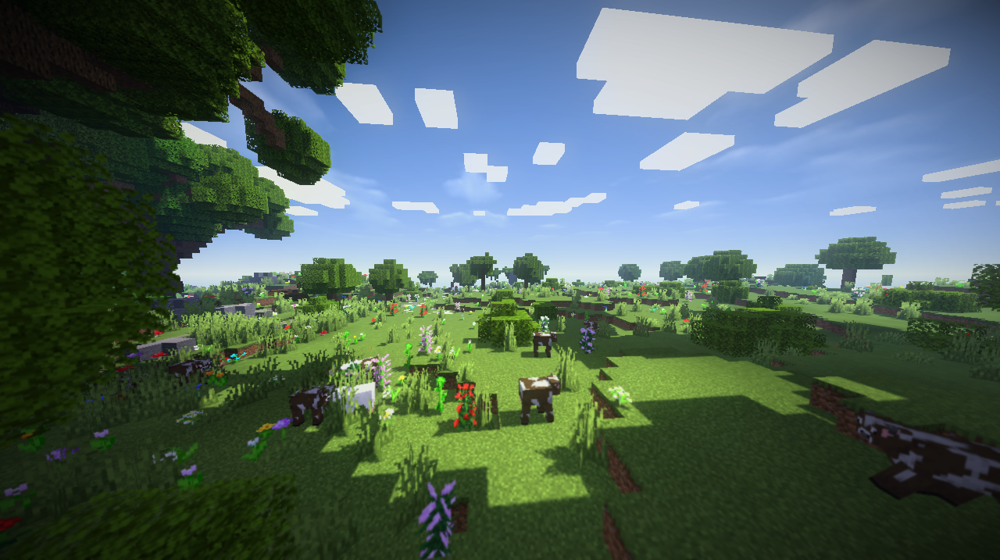
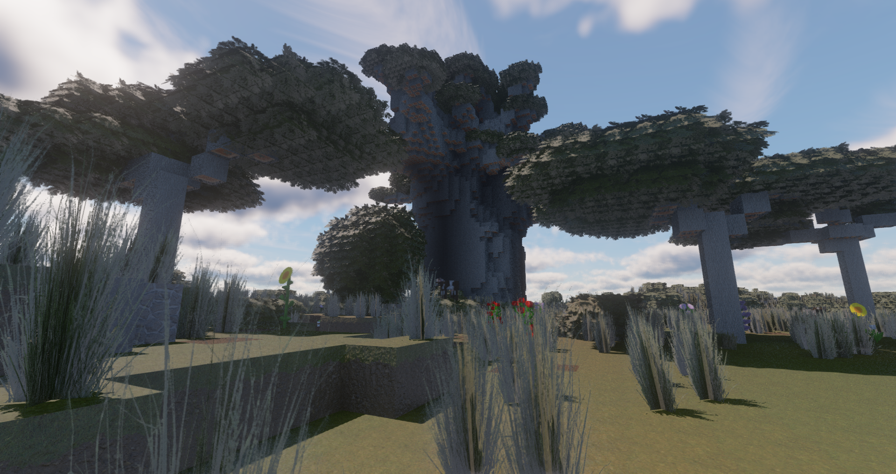
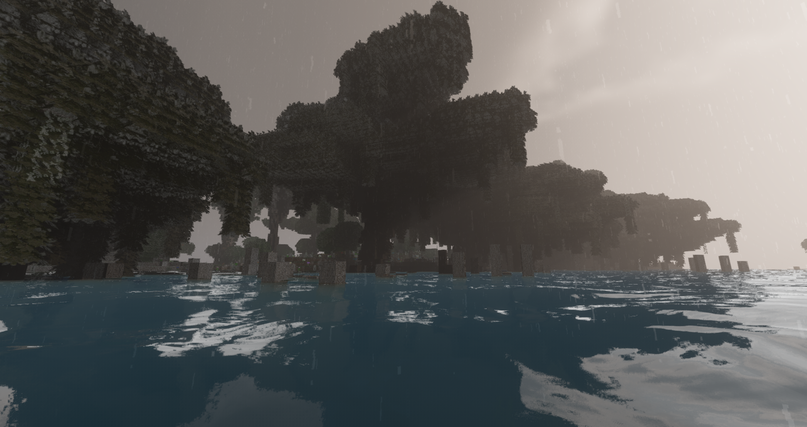
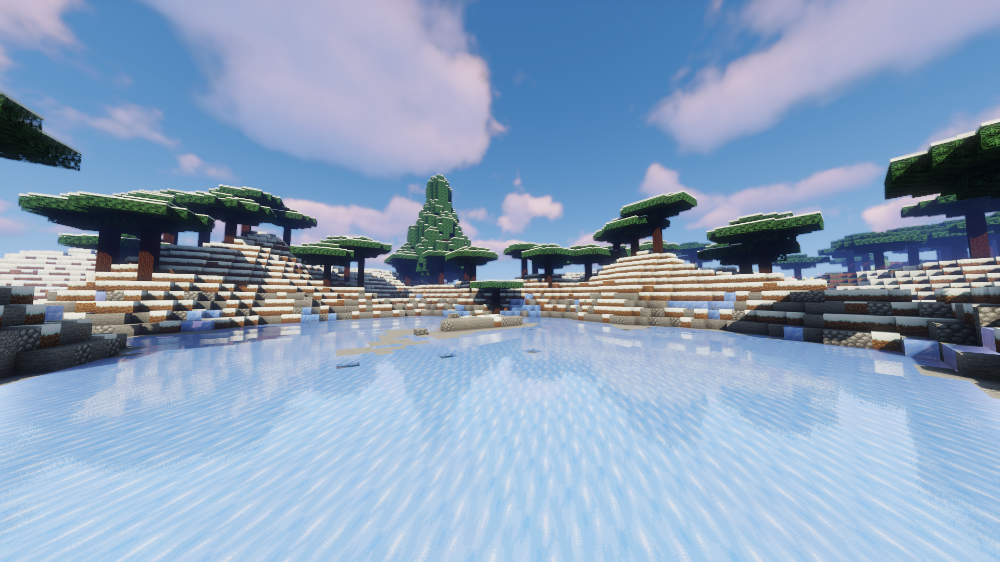
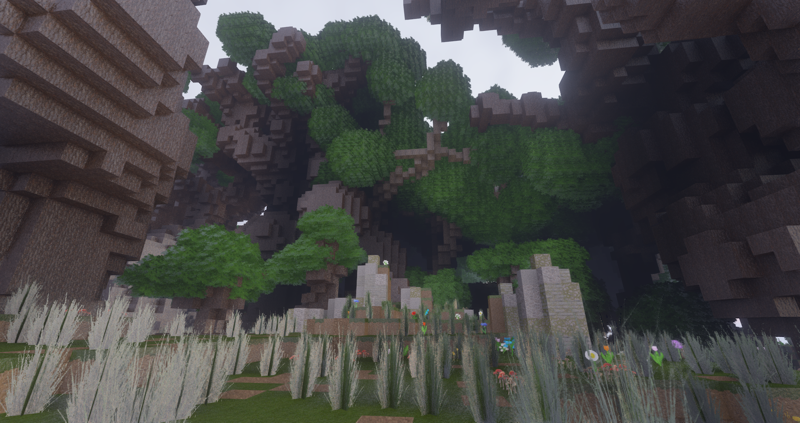
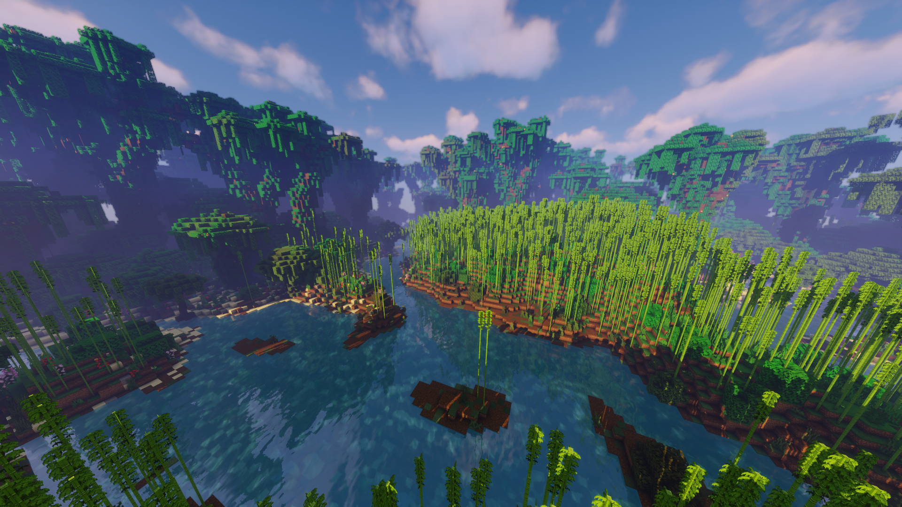
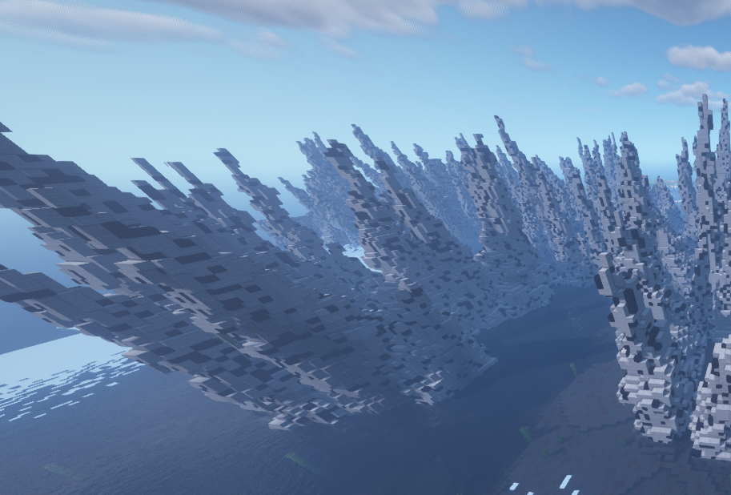

[![Contributors][contributors-shield]][contributors-url]
[![Forks][forks-shield]][forks-url]
[![Stargazers][stars-shield]][stars-url]
[![Issues][issues-shield]][issues-url]

<!-- TABLE OF CONTENTS -->
# Table of Contents

  
Table of Contents

  <ol>
    <li><a href="#support">Support</a></li>
    <li><a href="#about">About Project & Wiki</a></li>
    <li><a href="#getting-started">Getting started</a></li>
    <li><a href="#images">Images</a></li>
    <li><a href="#known-bugs">Known-Bugs</a></li>
  </ol>

## Support 

Support Discord: https://discord.gg/yW7JcqM

## About project & Wiki 

Wiki: https://github.com/Hex27/TerraformGenerator/wiki/Configuration

TerraformGenerator is a world generator plugin that aims to provide an enhanced vanilla feel. As of now, it is in an Alpha stage, meaning some core features are not implemented yet (a list of known issues and to-dos is at the bottom). However, the world should be playable to an extent, though I will not recommend putting it on any production environment that has strict requirements, because as of now, I am in mandatory National service, and support will be bottle-necked. 

There are commands, but they are developer commands and only available via /op. Try not to use them unless you understand what they do.

On another note, for 1.15.2, the version released on 23rd Feb 2020 is the recommended version, as it fixes an itchy spigot issue. More details at the bottom under "bugs". 1.14.4 does not have this fix.

There is also support for Java 14, but be warned that it will spit some minor errors, because the plugin does some Java illegal magic to get things done.

## Images 

Shader images captured by @PiggyPiglet, @ExxDee and @BecauseNyx 

All the non-shader vanilla images are all the way below.

## Known Bugs 

- Snowy Wasteland is a bit too literally empty. I'll be trying to find ways to make it more interesting
- Mountains are extremely plain now, except birch mountains. Will be finding ways to spice them up
- Some config options would be nice, perhaps for configuring some basics.

### Sort of resolved:

- Sometimes, physics updates are wonky, and this leads to things like dirt appearing in trees, and farmlands causing dirt to appear in the sky. For now, the fix for this is to update to the latest version of 1.15.2 (or later), as it was tracked to be a minor spigot problem. If you are unable to do so, pre-generate your world, then immediately restart it. The bug does not occur on an already generated world
- Some weird biomes spawn next to each other (like sandy beaches next to snowy taigas/cold oceans) Report any strange occurrences to me.
- When a world is first generated, the starting chunks may not be populated (e.g. no snow, no trees, no ores etc in these chunks). May or may not be a spigot bug that's being tracked here. It was indeed sort of a spigot side issue but since that's not going to be resolved anytime soon, screw it. I'll just bandaid it on my end.

<!-- MARKDOWN LINKS -->
[contributors-shield]: https://img.shields.io/github/contributors/othneildrew/Best-README-Template.svg?style=for-the-badge
[contributors-url]: https://github.com/Hex27/terraformgenerator/graphs/contributors
[forks-shield]: https://img.shields.io/github/forks/othneildrew/Best-README-Template.svg?style=for-the-badge
[forks-url]: https://github.com/Hex27/terraformgenerator/network/members
[stars-shield]: https://img.shields.io/github/stars/othneildrew/Best-README-Template.svg?style=for-the-badge
[stars-url]: https://github.com/Hex27/terraformgenerator/stargazers
[issues-shield]: https://img.shields.io/github/issues/othneildrew/Best-README-Template.svg?style=for-the-badge
[issues-url]: https://github.com/Hex27/terraformgenerator/issues
